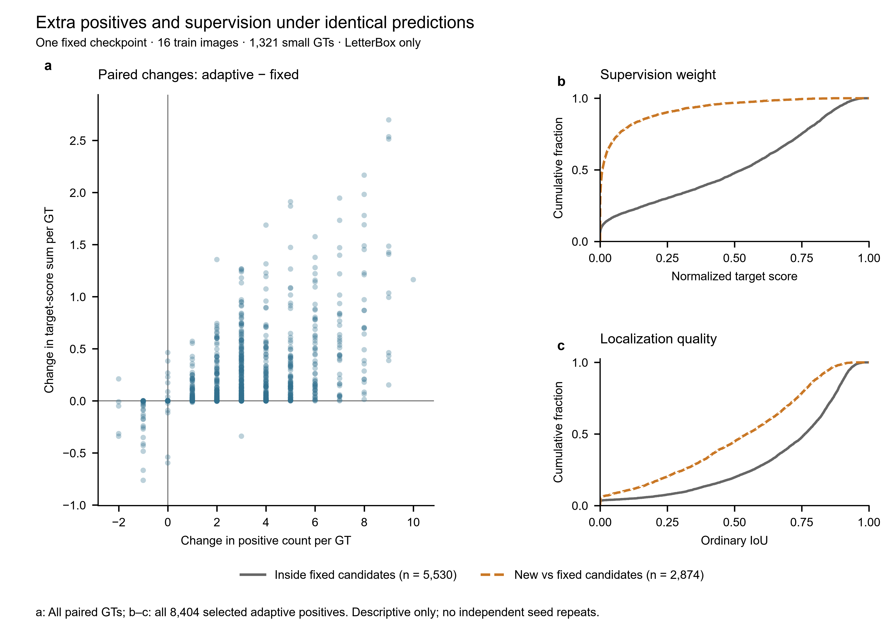
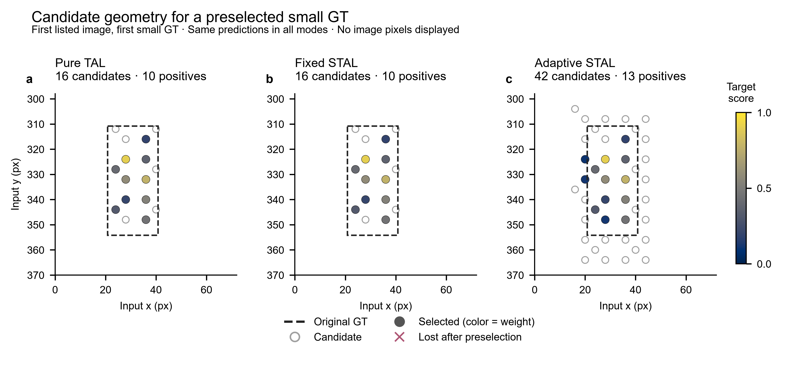

# VisDrone 上的尺度自适应标签分配：A2 实验报告

作者：YilinWang121054

版本：2026-09-15，新增第二轮 fixed 的120轮结果和完整逐轮统计，保留 P0 官方 MATLAB 实测对齐、旧三模式参考结果与候选诊断。P0材料已提交、待导师验收；第二轮 fixed 已完成，但尚无配套 adaptive 主对照，现有结果不支持P1提升目标，P2尚未完成。

## 研究问题

本课题想确认，小目标获得更多正样本后，检测精度是否会随之提高。VisDrone 图像中的行人、车辆往往很小，部分 GT 框内没有足够的特征网格。仅提高 top-k 无法增加原本不存在的候选位置，因此实验先改变候选覆盖，再调整不同尺度的 top-k。

YOLO-Master 在本轮项目开始前已经具有固定 stride 的 STAL 行为：框的一条边小于最小 stride 时，将该边扩展到中间 stride。本文的新增工作是面积自适应候选扩展、候选不足时的补充，以及小/中/大目标分别设置 top-k。原有固定扩展不计作本轮新增贡献。

## 基线、数据与实验约定

历史成果补充细则指定的公共基线为 `acce839c7e895d6b179de7f7093fa879e237cc7b`，P0补跑使用这一原始代码。三模式对照训练使用的 A2 提交是 `52c2befa50706b9dff13b6e0813b19413d9f532d`，其直接上游是 `0996b7da14dfaafae9d4488e960814ff19eb19ce`。两个上游版本间的 30 个提交属于社区已有工作。个人功能改动位于 TAL、检测 loss 的配置注入、默认配置与校验、STAL 测试这 5 个文件中。

模型使用 v0.1-N。其 YAML 在公共基线、直接上游和 A2 训练提交中的 Git blob 相同，trainer 也相同。A2 代码的 fixed 模式包含冲突修复，因此本文将它称为“修复后的 fixed 对照”。它的候选扩展几何与旧版本相同，但全部分配行为并非与公共基线逐位等价。

数据为完整 VisDrone2019-DET：训练 6471 张，验证 548 张。训练分辨率 800，batch=4，FP32，从 YAML 初始化，不加载预训练权重，训练 120 epoch，patience=0。主要结果取第 120 轮 last.pt。Mosaic=1、close_mosaic=10，mixup/copy_paste=0。除下文列出的早期seed差异外，显式 MuSGD 参数为 lr0=0.01、momentum=0.9、weight_decay=0.0005、warmup_bias_lr=0。nbs=64，常规阶段累计 16 个 microbatch，warmup 阶段动态调整累积数量，epoch 尾部也会更新参数。

这是一套根据导师意见和 6 GB 显存约束设定的控制协议，不是仓库旧脚本的逐参数复刻。旧脚本使用 batch=6、mixup/copy_paste=0.1、close_mosaic=15、patience=20。

协议审计发现，seed 20260824 的 fixed/adaptive 使用了 optimizer=auto；启动日志显示 momentum=0.9，但 warmup 根据 args.momentum 将实际值改为 0.937，最后的 optimizer checkpoint 也为 0.937。pure TAL 同 seed 的 warmup_bias_lr 还保留了 0.1。后续两个 seed 显式使用 momentum=0.9、warmup_bias_lr=0。按9月11日确认的口径，seed 20260824三组单列为探索性实验，不纳入正式三seed对比；早期缺少完整逐轮统计的实验也仅供参考。

### 评测口径

总体 AP、AP50、AP75、AR500 的早期表格来自 `tjiiv-cprg/visdrone-det-toolkit-python`。9 月 9 日 CPU 审计发现其正数 `.5` 取整、同分排序、ignore IoF 和边界裁剪与官方源码存在差异，此后改用 `scripts/evaluate_visdrone_det_strict.py`。9 月 13 日，原始 P0 的同一批 548 张预测已在 MATLAB R2024a Update 7 中调用原官方工具成功评测；四项总体指标与该 Python 移植实现的最大差异为 1.28×10⁻¹² 个百分点，低于导师规定的 0.01。详见[MATLAB 实测说明与原始日志](DET官方MATLAB实测对齐-20260913.md)。

9月11日的[源码逐项对照与边界测试](DET源码逐项对照-20260911.md)仍保留为实现审计；9月13日新增的是实际跨语言运行证据，两者不混称。旧 JSON 中的 `runtime_parity=pending original MATLAB execution` 是当时状态，未回写原始记录；当前对齐状态以新增的 comparison.json 为准。本次运行覆盖固定 P0 预测，不声称所有可能输入均经过 MATLAB 实测。

面积补充指标采用原始验证图像中 GT bbox 的面积：small <1024，medium 为 [1024,9216)，large ≥9216；APs 取 IoU=.50:.95 的平均，maxDets=500。该分档由本课题采用，不是 VisDrone 官方分档。计算前对 GT 和预测应用官方 ignore-region 过滤规则，不以复制 crowd 区域替代总体评测。

核查发现，COCO evaluator 的默认区间包含两端，恰好位于阈值的目标会同时落入两档。原 val 有 13 个面积为 1024 的有效 GT、1 个面积为 9216 的 GT。9月10日完成面积半开区间、ignore区域取整与图像边界修正后，使用保存的预测重新评测六组历史实验。下表采用这一版面积结果和MATLAB-source DET审计移植结果；早期公开文件保留用于追溯，不混用旧版本指标。

## 方法

三个模式共享模型和损失主体。pure TAL 使用原 GT 候选区域；fixed 按旧 stride 规则扩展；adaptive 对增强、resize 后面积小于 1024 的 GT 扩展候选区域，宽高乘以 1.5，并至少扩展到两倍最小 stride。若候选仍不足 3 个，补入离框中心最近的网格。small/medium/large 的 top-k 分别为 13/10/10。alpha=0.5、beta=6 和 CIoU 排序不变。

“至少 3 个”约束作用于冲突消解之前，并不保证每个 GT 最终都有 3 个正样本。多个 GT 竞争同一 anchor 时，仍须维持一锚一 GT。另一个区别是，候选数量与有效监督权重并不相同：TAL 会根据分类分数和 IoU 归一化 target score。被选中的候选若 IoU 为零，可能得到零权重，计入正样本 mask 也不等于提供了同等强度的监督。

### 一个已修复的问题

早期 smoke 中，一个 GT 最终获得的正样本数超过了配置 top-k。原因是冲突代码在所有 GT 上直接对 overlap 取 argmax。当争用候选的 IoU 均为零时，它可能选中一个从未提出该候选的 GT。修复将非候选位置设为负无穷，再选择冲突归属。

有问题的早期结果未进入正式表格。修复独立提交为 [PR #253](https://github.com/Tencent/YOLO-Master/pull/253)，isLinXu 于 2026 年 9 月 1 日回复 LGTM 并合并。本次 STAL 功能稿将引用这一已合并修复，不把同一修复重复申报。

## 已完成的实验结果

以下指标单位均为百分数；差值用绝对百分点。带†的总体列来自前述 Python 源码移植，该实现已在固定 P0 预测上取得官方 MATLAB 数值对齐证据。P1 各行仍是 Python 评测结果，不能改称各组均直接运行了 MATLAB。三档列为修正后的 COCO-style 补充结果。

| Seed | 模式 | DET AP† | AP50† | AP75† | AR500† | APs | APm | APl | ARs@500 |
| --- | --- | ---: | ---: | ---: | ---: | ---: | ---: | ---: | ---: |
| 20260824 | fixed | 22.4056 | 40.5718 | 21.4056 | 39.0022 | 13.5280 | 31.9935 | 39.4703 | 29.1766 |
| 20260824 | adaptive | 22.4328 | 40.3227 | 21.4823 | 38.5888 | 13.3655 | 32.0546 | 40.5131 | 28.8453 |
| 20260824 | pure TAL* | 21.5405 | 38.7786 | 20.3947 | 37.8632 | 12.6040 | 31.2151 | 39.5915 | 27.7936 |
| 20260825 | fixed | 21.7619 | 39.4407 | 20.7115 | 38.1235 | 13.0766 | 31.0920 | 39.4663 | 28.4817 |
| 20260825 | adaptive | 21.4915 | 38.9398 | 20.1943 | 37.7670 | 12.7361 | 30.4258 | 36.7081 | 27.9816 |
| 20260825 | pure TAL | 21.5140 | 38.6952 | 20.3479 | 37.9991 | 12.7167 | 31.0028 | 42.0973 | 28.3010 |
| 20260826 | fixed | 21.7828 | 39.6533 | 20.6035 | 38.2678 | 12.6454 | 30.8524 | 40.8172 | 28.0815 |
| 20260826 | adaptive | 21.7494 | 39.3220 | 20.4308 | 37.8461 | 13.0384 | 30.9957 | 40.1542 | 27.9221 |
| 20260826 | pure TAL | 21.5635 | 38.6339 | 20.6763 | 38.0658 | 12.6504 | 31.6636 | 40.6959 | 28.4458 |

*seed 20260824 的 pure TAL 与另两组有前述 warmup 和 momentum 差异；该seed三组均为探索性对照。表中早期实验没有完整逐轮训练统计，保留为三模式的参考结果，不构成正式三seed验收矩阵。

三个seed的adaptive−fixed ΔAPs依次为−0.1625、−0.3405、+0.3930个百分点，方向并不一致。seed 20260826中，adaptive的总体AP比fixed低0.0334、APl低0.6630；pure TAL的APs与fixed接近，差值为+0.0050。小目标APs的局部改善不能替代对总体和其他面积档表现的检查。

导师规定的P1条件同时要求统一协议下平均ΔAPs≥+1.0、至少2/3 seed正向。seed 20260824已排除出正式重复实验，且这些对照没有完整逐轮训练统计，因此不能把九行结果当作完整的正式三seed验收矩阵。统一协议补跑和统计缺项仍需明确保留，不通过挑seed或事后调参改变验收规则。

9月13日08:07，pure TAL同seed的CPU完整评测结束，至此seed 20260826三组均已完成120轮及548张验证。[最终核验与原始证据](../../results/closure-evaluation/p1-tal-s20260826/)保留了关机恢复记录和checkpoint校验。第三seed三模式与下面的P0基线均使用CPU完成FP32推理；前两seed的保存预测来自GPU。各组保留推理设备和预测哈希，不将CPU/GPU数值等价当作未经检查的前提。训练器内置mAP不代替上述DET或面积指标。

### 第二轮统计完整的 fixed 对照

9月15日新增的 fixed seed 20260825 已完成120轮和548张正式评测。它从第一轮收集真实增强后统计，补齐120份记录、194160个训练batch，且显式冻结了训练参数。它是独立补跑，不替换上面的旧同seed行，也不与旧adaptive直接组成新的正式对照。

| DET AP† | AP50† | AP75† | AR500† | APs | APm | APl | ARs@500 |
| ---: | ---: | ---: | ---: | ---: | ---: | ---: | ---: |
| 21.7623 | 39.4334 | 20.6445 | 38.2003 | 13.0095 | 30.9791 | 38.8920 | 28.4545 |

本组使用第120轮last.pt和CPU FP32预测。初次额外启动MATLAB时返回5201；作者打开本机MATLAB后，09:24完成了[本组官方补评](P1第二轮fixed-MATLAB补评成功-20260915.md)，四项总体指标与Python最大差约1.21×10⁻¹²个百分点。原[完成说明](P1第二轮fixed完成-20260915.md)及失败日志作为当时记录保留，[逐轮曲线和源数据](../../results/closure-evaluation/p1-v2-fixed-s20260825-stats120/figures/)保留全部观测。单组fixed完成没有改变P1尚未达标的结论。

### P0原始基线及逐轮记录

原始acce839基线已完成120轮，完整548张验证的结果如下。它不包含#253修复，且不能与存在optimizer差异的早期fixed行直接组成严格的修复效果对照。

| DET AP† | AP50† | AP75† | AR500† | APs | APm | APl | ARs@500 |
| ---: | ---: | ---: | ---: | ---: | ---: | ---: | ---: |
| 21.7003 | 39.3606 | 20.6084 | 38.2194 | 12.5117 | 30.7556 | 39.7667 | 28.2175 |

120份在线统计均覆盖每轮1618个训练batch，共194160个batch。下图是这一单次训练中各面积档冲突后的平均正样本数，不是多seed均值或置信区间。最后10轮按配置关闭Mosaic，训练目标分布随增强条件变化。

第120轮的分档统计见下表。这里的GT是增强、resize后进入assigner的目标观测，不是原始验证集中的唯一目标数。

| 面积档 | GT观测数 | 平均正样本数 | P50 | P90 | 零正样本比例 |
| --- | ---: | ---: | ---: | ---: | ---: |
| small | 272081 | 4.0384 | 3 | 10 | 7.0016% |
| medium | 44304 | 9.9402 | 10 | 10 | 0.0339% |
| large | 2491 | 9.9803 | 10 | 10 | 0.0803% |

完整120轮的四阶段统计，包括原框候选、扩展后候选、冲突前与冲突后数量，见[曲线源数据](../../results/closure-evaluation/p0-locked-s20260824-stats120/figures/assignment-source-data.csv)和[逐轮JSON](../../results/closure-evaluation/p0-locked-s20260824-stats120/assignment/)。

## 机制证据能说明什么

固定 64 train / 32 val、1 epoch、Mosaic off 的早期探针中，small GT 的训练零正样本比例从 fixed 的 17.91% 降至 adaptive 的 5.88%，平均正样本从 3.721 增至 6.473。三组当时的 mAP 均为零。这说明候选扩展在该子集上改善了覆盖，不能证明长训精度提高。

为了进一步看清“数量增加”对应什么监督，9月13日固定fixed seed 20260826的last.pt，对16张预选train图像作相同FP32预测，只切换三种分配规则。本次不使用Mosaic或其他随机增强，也不更新模型。按LetterBox后实际面积划分的1321个small GT中，adaptive相对fixed的平均正样本数增加57.88%，平均target score之和仅增加8.65%。零正样本比例由9.0083%降至6.8887%，但零权重GT比例由9.0083%变为9.1597%。覆盖改善与有效权重改善不能视作同一件事。

图1｜同一预测下的数量、权重和定位质量。a保留全部small GT的adaptive−fixed配对差异；b、c将adaptive最终small正样本分为fixed候选集合内与真正新增两组，分别显示target score和普通IoU的完整经验累积分布。零值保留，GT和候选均不作独立seed。两组定义、样本数与图级数据见[完整图注](../../results/candidate-quality-20260913/figures-v1/)。

图2｜同一小目标在三种规则下的候选位置。按预先固定的名单顺序选择第一张图的第一个small GT，而非选取改善最大的例子。空心圆为候选，实心圆为最终正样本，颜色为target score；黑色框为尚未扩展的输入GT，三图共享像素坐标和色标。本例TAL与fixed恰好一致，且没有冲突后丢失的位置，不能代表全体GT。

相对fixed候选集合真正新增且最终选中的2874个small正样本，其target score均值为0.0733，普通IoU均值为0.5042。small GT在adaptive冲突前后平均正样本数为8.9932和6.3618，fixed为4.7638和4.0295。这些局部观察支持继续检查候选质量和GT争用，但没有分离候选扩展与top-k的贡献，也不能证明它们造成长训APs变化。探针使用fixed训练出的模型，尚无跨checkpoint验证；Mosaic交互也仍待实验。

这次离线采集的48次forward输出与原分配器逐位一致，原始记录及[独立汇总核验](../../results/candidate-quality-20260913/verification.json)已保留。它不是原120轮训练统计的补录。完整逐轮统计现覆盖P0原始基线和上述第二轮fixed，每轮与实际train batch数核对，验证调用不计入；旧三模式的统计缺项不据此补记为完成。

## 工程核对与剩余工作

训练使用checkpoint恢复，并在恢复前检查代码版本、训练参数和已完成轮次的统计。P0在电脑重启后从完整119轮checkpoint恢复，重跑尚未完成的最后一轮；没有声称从中断batch逐位接续。初次启动和各次恢复的stdout/stderr均按原字节保留，失败记录未删除。具体记录见[P0运行完成记录](P0运行完成记录-20260911.md)。

最终功能代码已与上游7bfbfd3合并核对，STAL、默认配置、模型配置、TAL冲突和MPS回归五个测试文件为33 passed、1 skipped。MPS在本机不可用；CPU回归不替代真实batch的CUDA AMP验证。NaN/Inf参数拒绝测试已补充。A2改动文件的15项Ruff诊断均已存在于最新上游，没有新增；改动文件的格式和拼写检查通过，但全仓检查并未全部通过。

P0的训练、逐轮统计、分档结果、原始日志和官方 MATLAB 实测对齐已收齐，待导师验收。P1尚缺同协议三seed主表、对应训练期统计与Mosaic交互，现有参考结果也未达到提升目标。9月13日新增的[真实增强 batch CUDA 检查](../../results/p1-v2-amp-audit-20260913/README.md)发现：三模式的 FP32/AMP loss 和梯度均有限，但分配并不完全一致，梯度相对 L2 差异约9%～15%。第二轮保持FP32，带逐轮统计的fixed 120e已完成；9月15日获准进行[有限筛选](P1第二轮筛选冻结-20260915.md)，按1组fixed和5组adaptive、各20轮建立了队列，尚未选出配置。正式主对照与Mosaic交互仍待补齐。P2扫描和扩展仍未完成；#253单列为工程贡献，不以代码合并或smoke通过替代量化要求。

## 复现与资料

公开证据仓库：[YOLO-Master-A2-Smoke-2026](https://github.com/YilinWang121054/YOLO-Master-A2-Smoke-2026)。已有社区进度：[Issue #246](https://github.com/Tencent/YOLO-Master/issues/246)。本报告与下列证据随同一提交发布，历史版本继续保留。

- 基线和协议审计：`results/closure-audit-20260909.json`，脚本 `scripts/collect_closure_audit.py`。
- 修正后的六组分档指标：`results/area-audit-20260910/`，脚本 `scripts/recompute_area_audit.py`。
- 本文六组总体列：`results/official-det-strict-audit-p1-*.json`，不是原MATLAB执行结果。
- P0和第三seed三模式：`results/closure-evaluation/`，各自包含配置、checkpoint/预测校验、分档指标与评测清单。P0另有120份统计及曲线源数据。
- P0独立复评输入：[548份DET预测](../../results/closure-evaluation/p0-locked-s20260824-stats120/predictions-det-548.zip)及[原始预测JSON压缩包](../../results/closure-evaluation/p0-locked-s20260824-stats120/predictions.json.gz)。不包含原始图像或GT；归档解压后的字节已与评测输入核对。
- 原始 DET 指标及训练日志：`results/p1-*/`、`logs/`。旧 crowd-per-class 结果只作历史审计。
- P0 补跑：`scripts/run_p0_baseline.py`；只读预检查使用 `--check-only`；`--cpu-smoke` 是内置微型数据测试，不是正式基线。
- 逐 epoch 采集：`scripts/assignment_observer.py`；中断后通过同一 runner 恢复，避免回到不带采集器的普通 CLI。
- 贡献diff：公共基线→最终提交用于总审计，个人变更剔除中间上游提交及已合并的#253。公开功能提交为 `2efc4d91d7363d65b6f38e7d47c585231bb98158`，其完整Git tree与本地测试提交6f55860相同；发布清单见 `results/github-a2-branch-publication-20260911.json`。该提交不冒充长训使用的52c2bef。

框架阅读入口为[YOLO-Master论文](https://arxiv.org/abs/2512.23273)和[YOLO-PEFT论文](https://arxiv.org/abs/2608.07051)。它们不作为本课题adaptive配置已改善APs的证据；本报告的新增行为与数值结论以对应源码、预测和原始日志为依据。

本课题使用公开 VisDrone 数据，数据与许可仍按原发布方要求获取。研究代码和报告由 AI 工具协助实现、核查与整理，按作者授权先提交，再由作者审核并修订；工具生成文字不作为实验结果来源。实际数字均可回溯到预测、日志或 checkpoint。没有将尚未运行的实验记为完成。
