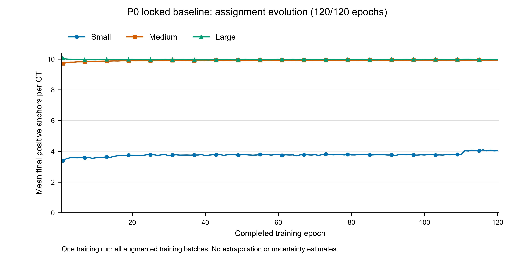

# VisDrone 上的尺度自适应标签分配：A2 实验报告

作者：YilinWang121054

版本：2026-09-11，结题报告首版，后续按作者审核意见更新。原始基线的120轮训练、逐轮正样本记录和完整验证已经完成；DET评测的原MATLAB运行对齐仍待确认。现有结果不支持P1提升目标，P2尚未完成。

## 研究问题

本课题想确认，小目标获得更多正样本后，检测精度是否会随之提高。VisDrone 图像中的行人、车辆往往很小，部分 GT 框内没有足够的特征网格。仅提高 top-k 无法增加原本不存在的候选位置，因此实验先改变候选覆盖，再调整不同尺度的 top-k。

YOLO-Master 在本轮项目开始前已经具有固定 stride 的 STAL 行为：框的一条边小于最小 stride 时，将该边扩展到中间 stride。本文的新增工作是面积自适应候选扩展、候选不足时的补充，以及小/中/大目标分别设置 top-k。原有固定扩展不计作本轮新增贡献。

## 基线、数据与实验约定

历史成果补充细则指定的公共基线为 `acce839c7e895d6b179de7f7093fa879e237cc7b`，P0补跑使用这一原始代码。三模式对照训练使用的 A2 提交是 `52c2befa50706b9dff13b6e0813b19413d9f532d`，其直接上游是 `0996b7da14dfaafae9d4488e960814ff19eb19ce`。两个上游版本间的 30 个提交属于社区已有工作。个人功能改动位于 TAL、检测 loss 的配置注入、默认配置与校验、STAL 测试这 5 个文件中。

模型使用 v0.1-N。其 YAML 在公共基线、直接上游和 A2 训练提交中的 Git blob 相同，trainer 也相同。A2 代码的 fixed 模式包含冲突修复，因此本文将它称为“修复后的 fixed 对照”。它的候选扩展几何与旧版本相同，但全部分配行为并非与公共基线逐位等价。

数据为完整 VisDrone2019-DET：训练 6471 张，验证 548 张。训练分辨率 800，batch=4，FP32，从 YAML 初始化，不加载预训练权重，训练 120 epoch，patience=0。主要结果取第 120 轮 last.pt。Mosaic=1、close_mosaic=10，mixup/copy_paste=0。除下文列出的早期seed差异外，显式 MuSGD 参数为 lr0=0.01、momentum=0.9、weight_decay=0.0005、warmup_bias_lr=0。nbs=64，常规阶段累计 16 个 microbatch，warmup 阶段动态调整累积数量，epoch 尾部也会更新参数。

这是一套根据导师意见和 6 GB 显存约束设定的控制协议，不是仓库旧脚本的逐参数复刻。旧脚本使用 batch=6、mixup/copy_paste=0.1、close_mosaic=15、patience=20。

协议审计发现，seed 20260824 的 fixed/adaptive 使用了 optimizer=auto；启动日志显示 momentum=0.9，但 warmup 根据 args.momentum 将实际值改为 0.937，最后的 optimizer checkpoint 也为 0.937。pure TAL 同 seed 的 warmup_bias_lr 还保留了 0.1。后续两个 seed 显式使用 momentum=0.9、warmup_bias_lr=0。因此第一对 fixed/adaptive 可以作内部比较，现有所有 seed 则不能当作完全同协议重复实验。最终如何补跑或单列这一对，待导师确认。

### 评测口径

总体 AP、AP50、AP75、AR500 的早期表格来自 `tjiiv-cprg/visdrone-det-toolkit-python`。9 月 9 日 CPU 审计发现它与 MATLAB 源码并不逐字等价：正数 `.5` 取整、同分排序、ignore IoF 和边界裁剪都会造成差异。现在使用 `scripts/evaluate_visdrone_det_strict.py` 保存一份 MATLAB-source audit port，重算时会标明 `runtime_parity=pending original MATLAB execution`。本机 MATLAB R2024a 的运行检查仍报 MathWorks 5201。因此本报告不会把 Python 审计写成原 MATLAB devkit 已成功运行。

面积补充指标采用原始验证图像中 GT bbox 的面积：small <1024，medium 为 [1024,9216)，large ≥9216；APs 取 IoU=.50:.95 的平均，maxDets=500。该分档由本课题采用，不是 VisDrone 官方分档。计算前对 GT 和预测应用官方 ignore-region 过滤规则，不以复制 crowd 区域替代总体评测。

核查发现，COCO evaluator 的默认区间包含两端，恰好位于阈值的目标会同时落入两档。原 val 有 13 个面积为 1024 的有效 GT、1 个面积为 9216 的 GT。9月10日完成面积半开区间、ignore区域取整与图像边界修正后，使用保存的预测重新评测六组历史实验。下表采用这一版面积结果和MATLAB-source DET审计移植结果；早期公开文件保留用于追溯，不混用旧版本指标。

## 方法

三个模式共享模型和损失主体。pure TAL 使用原 GT 候选区域；fixed 按旧 stride 规则扩展；adaptive 对增强、resize 后面积小于 1024 的 GT 扩展候选区域，宽高乘以 1.5，并至少扩展到两倍最小 stride。若候选仍不足 3 个，补入离框中心最近的网格。small/medium/large 的 top-k 分别为 13/10/10。alpha=0.5、beta=6 和 CIoU 排序不变。

“至少 3 个”约束作用于冲突消解之前，并不保证每个 GT 最终都有 3 个正样本。多个 GT 竞争同一 anchor 时，仍须维持一锚一 GT。另一个区别是，候选数量与有效监督权重并不相同：TAL 会根据分类分数和 IoU 归一化 target score。被选中的候选若 IoU 为零，可能得到零权重，计入正样本 mask 也不等于提供了同等强度的监督。

### 一个已修复的问题

早期 smoke 中，一个 GT 最终获得的正样本数超过了配置 top-k。原因是冲突代码在所有 GT 上直接对 overlap 取 argmax。当争用候选的 IoU 均为零时，它可能选中一个从未提出该候选的 GT。修复将非候选位置设为负无穷，再选择冲突归属。

有问题的早期结果未进入正式表格。修复独立提交为 [PR #253](https://github.com/Tencent/YOLO-Master/pull/253)，isLinXu 于 2026 年 9 月 1 日回复 LGTM 并合并。本次 STAL 功能稿将引用这一已合并修复，不把同一修复重复申报。

## 已完成的实验结果

以下指标单位均为百分数；差值用绝对百分点。带†的总体列来自前述MATLAB-source DET审计移植，未取得原工具运行对齐证明。三档列为修正后的COCO-style补充结果。

| Seed | 模式 | DET AP† | AP50† | AP75† | AR500† | APs | APm | APl | ARs@500 |
| --- | --- | ---: | ---: | ---: | ---: | ---: | ---: | ---: | ---: |
| 20260824 | fixed | 22.4056 | 40.5718 | 21.4056 | 39.0022 | 13.5280 | 31.9935 | 39.4703 | 29.1766 |
| 20260824 | adaptive | 22.4328 | 40.3227 | 21.4823 | 38.5888 | 13.3655 | 32.0546 | 40.5131 | 28.8453 |
| 20260824 | pure TAL* | 21.5405 | 38.7786 | 20.3947 | 37.8632 | 12.6040 | 31.2151 | 39.5915 | 27.7936 |
| 20260825 | fixed | 21.7619 | 39.4407 | 20.7115 | 38.1235 | 13.0766 | 31.0920 | 39.4663 | 28.4817 |
| 20260825 | adaptive | 21.4915 | 38.9398 | 20.1943 | 37.7670 | 12.7361 | 30.4258 | 36.7081 | 27.9816 |
| 20260825 | pure TAL | 21.5140 | 38.6952 | 20.3479 | 37.9991 | 12.7167 | 31.0028 | 42.0973 | 28.3010 |
| 20260826 | fixed | 21.7828 | 39.6533 | 20.6035 | 38.2678 | 12.6454 | 30.8524 | 40.8172 | 28.0815 |

*seed 20260824 的 pure TAL 与另两组有前述 warmup 和 momentum 差异，只作探索性对照。第一对与第二对之间也存在 momentum 差异。表格保留这些数据，不以不一致数据冒充严格三组、三 seed 重复。

两对 adaptive−fixed 的 ΔAPs 分别为 −0.1625、−0.3405 个百分点。描述性的两对平均差为 −0.2515；它不是同一协议三 seed 的验收均值。第二对 adaptive 的 APm 和 APl 也低于 fixed，不能只选择相对 pure TAL 稍好的 APs 来声称达标。

导师规定的 P1 条件同时要求平均 ΔAPs≥+1.0、至少 2/3 seed 正向。前两对均为负，意味着当前冻结候选已经无法满足正向 seed 数要求。仍将继续保留第三对的结果，以完整描述方案的边界；不会通过更换 seed 或事后改配置来改变验收规则。

seed 20260826 的adaptive仍在训练，pure TAL待运行，不填估计值。第三seed的fixed与下面的P0基线均使用CPU完成FP32推理；前两seed的保存预测来自GPU。各组都保留推理设备和预测哈希，不能把CPU/GPU数值等价当作未经检查的前提。训练器内置mAP不代替上述DET或面积指标。

### P0原始基线及逐轮记录

原始acce839基线已完成120轮，完整548张验证的结果如下。它不包含#253修复，且不能与存在optimizer差异的早期fixed行直接组成严格的修复效果对照。

| DET AP† | AP50† | AP75† | AR500† | APs | APm | APl | ARs@500 |
| ---: | ---: | ---: | ---: | ---: | ---: | ---: | ---: |
| 21.7003 | 39.3606 | 20.6084 | 38.2194 | 12.5117 | 30.7556 | 39.7667 | 28.2175 |

120份在线统计均覆盖每轮1618个训练batch，共194160个batch。下图是这一单次训练中各面积档冲突后的平均正样本数，不是多seed均值或置信区间。最后10轮按配置关闭Mosaic，训练目标分布随增强条件变化。

第120轮的分档统计见下表。这里的GT是增强、resize后进入assigner的目标观测，不是原始验证集中的唯一目标数。

| 面积档 | GT观测数 | 平均正样本数 | P50 | P90 | 零正样本比例 |
| --- | ---: | ---: | ---: | ---: | ---: |
| small | 272081 | 4.0384 | 3 | 10 | 7.0016% |
| medium | 44304 | 9.9402 | 10 | 10 | 0.0339% |
| large | 2491 | 9.9803 | 10 | 10 | 0.0803% |

完整120轮的四阶段统计，包括原框候选、扩展后候选、冲突前与冲突后数量，见[曲线源数据](../../results/closure-evaluation/p0-locked-s20260824-stats120/figures/assignment-source-data.csv)和[逐轮JSON](../../results/closure-evaluation/p0-locked-s20260824-stats120/assignment/)。

## 机制证据能说明什么

固定 64 train / 32 val、1 epoch、Mosaic off 的早期探针中，small GT 的训练零正样本比例从 fixed 的 17.91% 降至 adaptive 的 5.88%，平均正样本从 3.721 增至 6.473。三组当时的 mAP 均为零。这说明候选扩展在该子集上改善了覆盖，不能证明长训精度提高。

长训的负结果至少留下三个需要检验的解释。其一，新增候选可能较多但 target score 很低，实际监督增量有限。其二，密集区域中候选重叠增加，会让一部分 GT 在冲突后重新失去候选。其三，Mosaic 改变训练目标面积，与原图评测分档不一一对应。完整逐轮记录目前仅覆盖新P0原始基线，没有覆盖先前的adaptive长训；因此这些仍是待检验解释，不是已证明的原因。

采集器已在原始锁定代码上完成CPU训练烟测，并通过输出逐位一致与RNG状态不变的测试。正式P0中，每轮统计与实际完成的train batch数核对，验证调用不计入。事后固定checkpoint探针即使补做，也会另行标记，不补造原长训历史。

## 工程核对与剩余工作

训练使用checkpoint恢复，并在恢复前检查代码版本、训练参数和已完成轮次的统计。P0在电脑重启后从完整119轮checkpoint恢复，重跑尚未完成的最后一轮；没有声称从中断batch逐位接续。初次启动和各次恢复的stdout/stderr均按原字节保留，失败记录未删除。具体记录见[P0运行完成记录](P0运行完成记录-20260911.md)。

最终功能代码已与上游7bfbfd3合并核对，STAL、默认配置、模型配置、TAL冲突和MPS回归五个测试文件为33 passed、1 skipped。MPS在本机不可用；CPU回归不替代真实batch的CUDA AMP验证。NaN/Inf参数拒绝测试已补充。A2改动文件的15项Ruff诊断均已存在于最新上游，没有新增；改动文件的格式和拼写检查通过，但全仓检查并未全部通过。

P0的训练、逐轮统计、分档结果和原始日志已经收齐；DET原工具运行对齐或导师对验证范围的认可仍待完成。P1尚缺同协议三seed主表、对应训练期统计与Mosaic交互，现有两对的提升目标也没有达到。P2的阈值、warmup扫描及第二数据集/任务尚未完成。本文不以代码合并或smoke通过替代这些量化要求。

## 复现与资料

公开证据仓库：[YOLO-Master-A2-Smoke-2026](https://github.com/YilinWang121054/YOLO-Master-A2-Smoke-2026)。已有社区进度：[Issue #246](https://github.com/Tencent/YOLO-Master/issues/246)。本报告与下列证据随同一提交发布，历史版本继续保留。

- 基线和协议审计：`results/closure-audit-20260909.json`，脚本 `scripts/collect_closure_audit.py`。
- 修正后的六组分档指标：`results/area-audit-20260910/`，脚本 `scripts/recompute_area_audit.py`。
- 本文六组总体列：`results/official-det-strict-audit-p1-*.json`，不是原MATLAB执行结果。
- P0和第三seed fixed：`results/closure-evaluation/`，各自包含配置、checkpoint/预测校验、分档指标与评测清单。P0另有120份统计及曲线源数据。
- P0独立复评输入：[548份DET预测](../../results/closure-evaluation/p0-locked-s20260824-stats120/predictions-det-548.zip)及[原始预测JSON压缩包](../../results/closure-evaluation/p0-locked-s20260824-stats120/predictions.json.gz)。不包含原始图像或GT；归档解压后的字节已与评测输入核对。
- 原始 DET 指标及训练日志：`results/p1-*/`、`logs/`。旧 crowd-per-class 结果只作历史审计。
- P0 补跑：`scripts/run_p0_baseline.py`；只读预检查使用 `--check-only`；`--cpu-smoke` 是内置微型数据测试，不是正式基线。
- 逐 epoch 采集：`scripts/assignment_observer.py`；中断后通过同一 runner 恢复，避免回到不带采集器的普通 CLI。
- 贡献diff：公共基线→最终提交用于总审计，个人变更剔除中间上游提交及已合并的#253。公开功能提交为 `2efc4d91d7363d65b6f38e7d47c585231bb98158`，其完整Git tree与本地测试提交6f55860相同；发布清单见 `results/github-a2-branch-publication-20260911.json`。该提交不冒充长训使用的52c2bef。

框架阅读入口为[YOLO-Master论文](https://arxiv.org/abs/2512.23273)和[YOLO-PEFT论文](https://arxiv.org/abs/2608.07051)。它们不作为本课题adaptive配置已改善APs的证据；本报告的新增行为与数值结论以对应源码、预测和原始日志为依据。

本课题使用公开 VisDrone 数据，数据与许可仍按原发布方要求获取。研究代码和报告由 AI 工具协助实现、核查与整理，按作者授权先提交，再由作者审核并修订；工具生成文字不作为实验结果来源。实际数字均可回溯到预测、日志或 checkpoint。没有将尚未运行的实验记为完成。
